# Sodayon ERP Entity-Relationship Diagram (ERD)

This document provides a highly detailed, professional visual **Entity-Relationship Diagram (ERD)** to help you understand the entire database architecture of the **Sodayon** children's e-commerce platform.

---

## 🗺️ Visual ERD (Mermaid Notation)

```mermaid
erDiagram
    %% ==========================================
    %% 1. USER & SECURITY MODULE
    %% ==========================================
    User {
        ObjectId _id PK
        string name
        string email UK
        string password "hashed"
        string role "CUSTOMER | SUPER_ADMIN | INVESTOR..."
        json permissions "canViewFinances | canManageContent..."
        string otp "6-digit OTP code"
        date otpExpiresAt
    }

    %% ==========================================
    %% 2. CATEGORY & TAXONOMY MODULE
    %% ==========================================
    Category {
        ObjectId _id PK
        string slug UK
        string nameEn
        string nameBn
        string descriptionEn
        string descriptionBn
        string icon
        int sortOrder
        boolean showInMegaMenu
        boolean showInDropdown
        boolean showInIconGrid
        ObjectId parentId FK "self-reference"
    }

    %% ==========================================
    %% 3. DYNAMIC UI LAYOUT MODULE
    %% ==========================================
    UISection {
        ObjectId _id PK
        string type "HERO_BANNER | QUICK_DEAL | FLASH_SALE..."
        string titleEn
        string titleBn
        int sortOrder
        boolean isVisible
        string theme "pastel-pink | dark-luxury..."
        string bgPattern
        string layoutStyle "GRID | CAROUSEL | LIST"
        json gridColsResponsive "responsive column sizing"
        int maxItems
        string bannerImageEn
        string bannerCtaTextEn
        string bannerLink
        json bannerContextQuery "targeted product filters"
    }

    %% ==========================================
    %% 4. CATALOG & VARIATIONAL SKU MODULE
    %% ==========================================
    Product {
        ObjectId _id PK
        string sku UK "master model code"
        string slug UK
        string modelCode
        string brandEn
        string brandBn
        string nameEn
        string nameBn
        string descriptionEn
        string descriptionBn
        string image "main thumbnail URL"
        string[] images "media array"
        string videoUrl
        number price "base price"
        number originalPrice "strike price"
        number discount
        boolean isPublished
        boolean bestseller
        boolean new
        number avgRating
        number reviews "review count"
        number totalSold
        int ageMonthsMin "extracted search facet"
        int ageMonthsMax "extracted search facet"
        string ageRange "backward compatibility"
        int safetyScore "safety rating 1-10"
        json specifications "polymorphic mixed fields"
        ObjectId[] categories FK "references Category collection"
        string[] tags
        string[] features
    }

    ProductVariant {
        ObjectId _id PK "variant-specific ID"
        string sku UK "variant SKU (e.g. SDY-TENT-BLU)"
        string nameEn
        string nameBn
        number price "variant price override"
        number originalPrice
        int stock "variant inventory lock"
        string[] images "variant image overrides"
        json options "e.g. {color: 'Blue', size: 'M'}"
    }

    %% ==========================================
    %% 5. SHOPPING CART MODULE
    %% ==========================================
    Cart {
        ObjectId _id PK
        ObjectId userId FK "references User (one-to-one)"
    }

    CartItem {
        string id "references Product _id or Variant SKU"
        string name
        number price
        int quantity
        string image
    }

    %% ==========================================
    %% 6. CHECKOUT & ORDERS MODULE
    %% ==========================================
    Order {
        ObjectId _id PK
        ObjectId userId FK "references User (one-to-many)"
        number totalAmount "final checkout price"
        string status "pending | processing | shipped..."
        string paymentStatus "unpaid | paid | failed"
        string paymentMethod "stripe | cod"
        string stripePaymentIntentId
        string stripeClientSecret
        string shippingAddress
        string shippingPhone
        date createdAt
    }

    OrderItem {
        string id "references Product _id or Variant SKU"
        string name
        number price
        int quantity
        string image
    }

    %% ==========================================
    %% 7. CAMPAIGNS & COMBO OFFERS MODULE
    %% ==========================================
    FlashSale {
        ObjectId _id PK
        string titleEn
        string titleBn
        date startDate
        date endDate
        boolean isActive
    }

    FlashSaleItem {
        ObjectId productId FK "references Product"
        number salePrice
        int stockCap "campaign inventory limit"
        int soldCount "campaign sales cache"
        int purchaseLimitPerUser
    }

    ComboOffer {
        ObjectId _id PK
        string type "CURATED_FIXED | INTERACTIVE_CUSTOM"
        string nameEn
        string nameBn
        string descriptionEn
        string discountType "PERCENTAGE | FIXED_AMOUNT"
        number discountValue
        boolean isActive
        date startDate
        date endDate
    }

    ComboFixedItem {
        ObjectId productId FK "references Product"
        int quantity
    }

    ComboPool {
        string nameEn
        string nameBn
        int minSelect "items selection rules"
        int maxSelect
        ObjectId[] products FK "references Product array"
    }

    %% ==========================================
    %% RELATIONSHIPS MAPPING
    %% ==========================================
    User ||--|| Cart : "owns"
    User ||--o{ Order : "places"
    Cart ||--o{ CartItem : "contains embedded"
    Order ||--o{ OrderItem : "details items inside"
    
    Category ||--o{ Category : "recursively references (parent-child)"
    Product }o--o{ Category : "classified under"
    Product ||--o{ ProductVariant : "houses variational SKU matrix"
    
    FlashSale ||--o{ FlashSaleItem : "schedules promo items"
    ComboOffer ||--o{ ComboFixedItem : "packages curated"
    ComboOffer ||--o{ ComboPool : "defines interactive custom pools"
```

---

## 🔍 ERP Structural Explanations

### 1. The Variational SKU Matrix Structure
Instead of separating variants into a completely separate collection which would require complex database lookups, variants are **nested directly inside the Product document**. 
* Whenever you query the product catalog (e.g. `Product.find()`), the entire variant list (with colors, stock levels, custom prices) is returned in a single, fast read operation!

### 2. Category Hierarchy Mapping
The `parentId` field references another document *in the same Category collection*. This allows you to construct deep nesting trees (e.g., `Toys` -> `Educational` -> `STEM Sets`). By running `populate('children')`, Mongoose recursive paths load all sub-categories instantly.

### 3. Campaign & Combo Logic
* **Flash Sales**: Operate on a custom calendar. The allocated promotional inventory (`stockCap`) protects the main product inventory from being completely sold out at flash sale prices.
* **Combo Offers**:
  * For **Curated Fixed** combos, the system embeds specific items with set quantities.
  * For **Interactive Custom** combos, the system embeds rules pool (`ComboPool`). The checkout engine validates if the customer selected the minimum required items (`minSelect`) from each pool before unlocking the `discountValue`.
